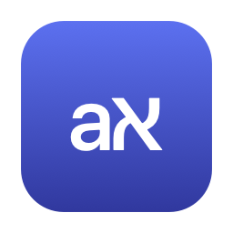
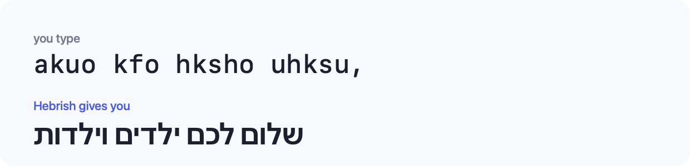

<p align="center">
  
</p>

<h1 align="center">Hebrish</h1>

<p align="center">
  <b>Typed Hebrew with your keyboard still in English?</b><br>
  Hebrish notices, fixes the word, and switches your layout — before you do.
</p>

<p align="center">
  
</p>

<p align="center">
  <sub>macOS 13+ · English ⇄ Hebrew · MIT</sub>
</p>

---

## Install

Needs the Xcode Command Line Tools — run `xcode-select --install` if you don't
have them.

```bash
git clone https://github.com/raznis/hebrish.git && cd hebrish && make install
```

Open **Hebrish** from your Applications folder. It asks for two permissions,
both under **System Settings → Privacy & Security**:

| Permission | Why |
|---|---|
| **Input Monitoring** | to notice the mistake |
| **Accessibility** | to fix it |

Enable both, then quit and reopen Hebrish. That's it.

> **You also need the Hebrew keyboard layout installed** — System Settings →
> Keyboard → Input Sources. Hebrish tells you if it is missing.

## Using it

There is nothing to configure. Just type.

- **Fixes the word the moment you finish it**, and flips your input source, so
  the rest of the sentence lands correctly.
- **Missed the first word?** A later one settles it, and the earlier words get
  fixed too, in one edit.
- **Shows you what changed**, with an **Undo** button.
- **Undo teaches it.** Reject a word once and Hebrish never touches it again.

The **aא** in your menu bar means it is watching. Pause it, review rejected
words, or run diagnostics from there.

## Privacy

Hebrish can see every keystroke, and is built to keep as little as possible.

- **Nothing you type is saved** — except words you deliberately reject, which
  are listed in the menu and clearable in one click.
- **Password fields are skipped**, by two independent checks.
- **No network access** once installed. It never phones anywhere.

[The full privacy design →](docs/DESIGN.md#privacy)

## Not working?

The menu's **Keys seen** counter is the giveaway: if it is stuck at 0, Hebrish
cannot read the keyboard, whatever System Settings claims.

[Troubleshooting →](docs/TROUBLESHOOTING.md)

## More

- [**How it works**](docs/DESIGN.md) — how it tells `akuo` from a real English
  word, and how often it gets it right
- [**Development**](docs/DEVELOPMENT.md) — building, tests, sharing a build

<sub>Language data derived from the
<a href="https://github.com/hermitdave/FrequencyWords">OpenSubtitles frequency
lists</a> (CC-BY-SA 4.0).</sub>
